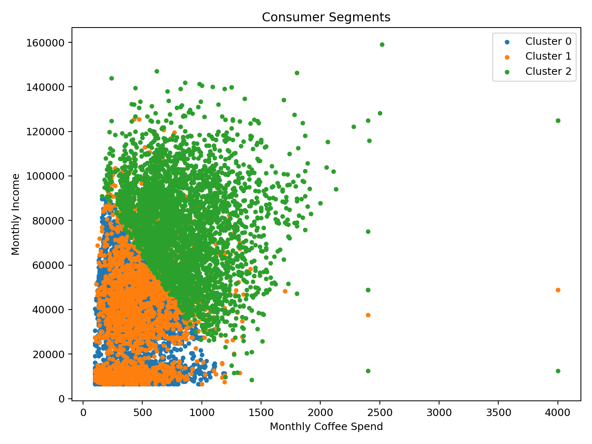
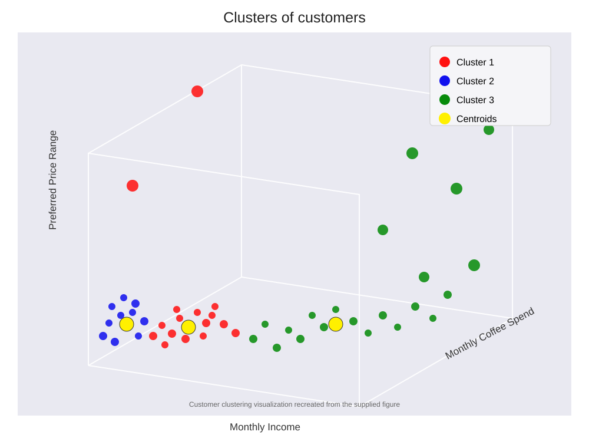
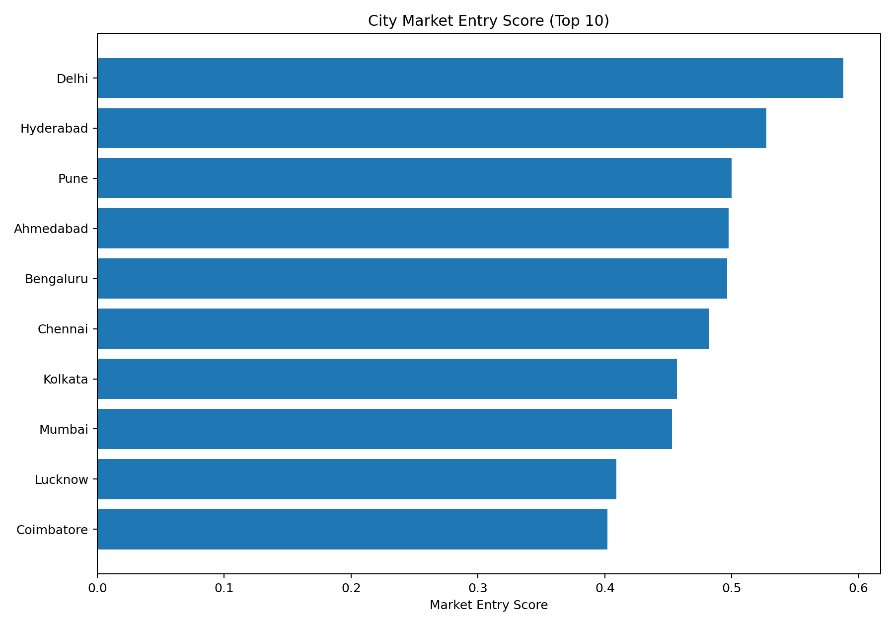

<div align="center">

# ☕ BrewInsights
### Indian Coffee Market Intelligence

**Consumer Analytics • Customer Segmentation • Machine Learning • Demand Intelligence • Interactive Dashboard**

[](https://www.python.org/)
[](https://pandas.pydata.org/)
[](https://scikit-learn.org/)
[](https://streamlit.io/)
[](LICENSE)
[](https://github.com/Shivamxxpathak/BrewInsights-Indian-Coffee-Market-Intelligence-/actions/workflows/quality.yml)

</div>

---

## 🚀 What is BrewInsights?

BrewInsights is an end-to-end analytics project built to understand **coffee consumer behaviour in India** from survey data.

**Raw Survey → Cleaning → EDA → Segmentation → Predictive Modeling → Demand Analysis → City Intelligence → Dashboard**

---

## 📂 Repository Structure

```text
BrewInsights-Indian-Coffee-Market-Intelligence/
├── README.md
├── LICENSE
├── .gitignore
├── requirements.txt
├── notebooks/
│   └── BrewInsights_Analysis.ipynb
├── dashboard/
│   ├── app.py
│   ├── README.md
│   ├── requirements_dashboard.txt
│   ├── run_dashboard.py
│   ├── run_dashboard.bat
│   └── START_DASHBOARD.cmd
├── data/
│   ├── README.md
│   ├── raw/ (source export withheld from public repo)
│   ├── processed/
│   ├── external_city_data.csv
│   ├── coffee_demand_by_period.csv
│   ├── coffee_demand_forecast.csv
│   └── coffee_demand_model_comparison.csv
├── outputs/
│   └── datasets/
│       ├── consumer_cluster_assignments.csv
│       ├── consumer_cluster_profiles.csv
│       ├── city_scores.csv
│       ├── city_cluster_assignments.csv
│       ├── city_cluster_profiles.csv
│       ├── city_clustering_metrics.csv
│       ├── city_opportunity_scores.csv
│       ├── market_entry_ranking.csv
│       ├── adoption_model_comparison.csv
│       ├── spending_model_comparison.csv
│       ├── recommendation_sensitivity.csv
│       └── partnership_experiment_template.csv
├── assets/
│   └── figures/
├── src/
│   ├── data_cleaning.py
│   ├── segmentation.py
│   ├── adoption_prediction.py
│   ├── spending_prediction.py
│   ├── demand_forecasting.py
│   └── market_entry.py
├── docs/
│   ├── DATA_DICTIONARY.md
│   ├── METHODOLOGY.md
│   ├── MODEL_EVALUATION.md
│   └── PROJECT_COMPLETION_NOTES.md
└── scripts/
    ├── missing_parts_added.py
    ├── anonymize_public_data.py
    └── run_pipeline.py
```

---

## ⚙️ Run the Analysis

```bash
python -m venv .venv
```

Windows:

```bash
.venv\Scripts\activate
```

Install:

```bash
pip install -r requirements.txt
```

Open:

```text
notebooks/BrewInsights_Analysis.ipynb
```

---

## 🖥️ Launch the Dashboard

```bash
pip install -r dashboard/requirements_dashboard.txt
streamlit run dashboard/app.py
```

On Windows, use `dashboard/START_DASHBOARD.cmd` or `dashboard/run_dashboard.bat`.

Do not run `dashboard/app.py` directly with Python. The dashboard must be launched through Streamlit.

---

## 📊 Analytical Components

### EDA
Consumer demographics, coffee frequency, coffee type, brands, spending, purchasing behaviour, price sensitivity, taste, loyalty and purchase intention.

### Customer Segmentation
K-Means and hierarchical/agglomerative clustering with silhouette evaluation.

### New Coffee Brand Adoption
Logistic Regression, Decision Tree, Random Forest, XGBoost and Gradient Boosting.

### Coffee Spending Prediction
Linear Regression with MAE, RMSE and R² evaluation.

### Demand Forecasting
24 ordered survey periods, three regression models, six future periods and explicit documentation of the time-series limitation.

### City Intelligence
City-level feature engineering, K-Means clustering, market-type classification, silhouette evaluation and opportunity scoring.

### Market Entry
Consumer profiles, city opportunity, market-entry ranking, sensitivity analysis and a partnership experiment template.

---

## 📈 Key Visuals



### Customer Clustering — 3D View



### City Market Entry Score



Additional analytical figures:

- [Adoption model comparison](assets/figures/adoption_model_comparison.svg)
- [Customer clusters — 3D](assets/figures/customer_clusters_3d.svg)
- [Demand forecast](assets/figures/demand_forecast.svg)
- [City opportunity](assets/figures/city_market_opportunity.svg)
- [Model evaluation summary](assets/figures/model_evaluation_summary.svg)

---

## 📚 Documentation

- [Data Dictionary](docs/DATA_DICTIONARY.md)
- [Methodology](docs/METHODOLOGY.md)
- [Model Evaluation](docs/MODEL_EVALUATION.md)
- [Dashboard Guide](dashboard/README.md)\n- [Reproducibility & Verification](docs/REPRODUCIBILITY.md)\n- [PPT / Documentation Alignment](docs/PPT_ALIGNMENT.md)

---

## 🧪 Quality & Verification\n\nThe repository includes automated tests and a GitHub Actions quality workflow covering required files, processed-data schema, privacy checks, non-empty analytical outputs, Python syntax compilation, dependency consistency, package imports and a Streamlit runtime smoke test.\n\nThe original executed notebook remains preserved as the analytical source of truth; the repository QA layer validates the published artifacts without silently replacing the saved model results.\n\n## ⚠️ Important Analytical Limitation

The survey does **not** contain genuine historical monthly sales data. The demand forecast therefore uses an ordered survey-derived demand series. The notebook explicitly treats this as a demonstration rather than an actual monthly Indian coffee sales forecast.

The repository preserves the executed model results, including negative R² values for the demand models, instead of silently replacing them.

## 🧹 Repository Quality Review

The repository was reviewed after the dashboard and visualization additions. Cleanup included:

- removed duplicate raw survey copies
- removed duplicate processed dataset copies
- consolidated the derived `city_scores.csv` under `outputs/datasets/`
- fixed the Windows dashboard launcher paths
- fixed the Python dashboard launcher path
- fixed the dashboard's survey-data path to the canonical processed dataset
- retained the executed notebook outputs rather than replacing analytical results

The public repository now separates source data, processed data, analytical outputs, reusable modules, dashboard code, figures and documentation.

---

## 🔐 Data Privacy

The original respondent-level raw survey is withheld from the public repository because the source export can contain direct identifiers. The dashboard uses the cleaned `data/processed/coffee_cleaned.csv` dataset.

Use `scripts/anonymize_public_data.py` to create a public-safe copy before publishing any respondent-level survey data.

---

## 👤 Project

**Shivam Pathak**

GitHub: [@Shivamxxpathak](https://github.com/Shivamxxpathak)

---

<div align="center">

### ☕ BrewInsights
**Turning coffee survey data into market intelligence.**

</div>
